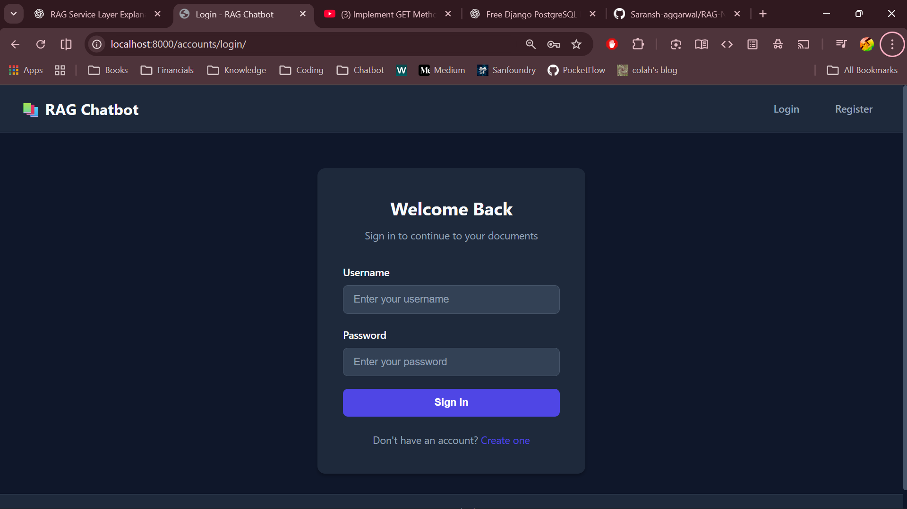
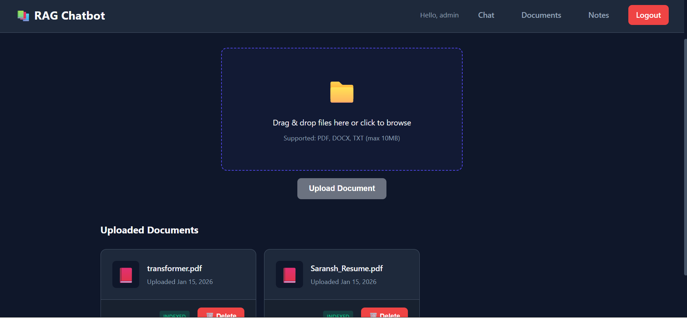
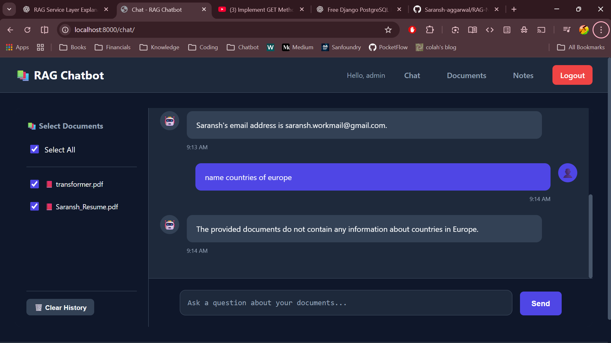
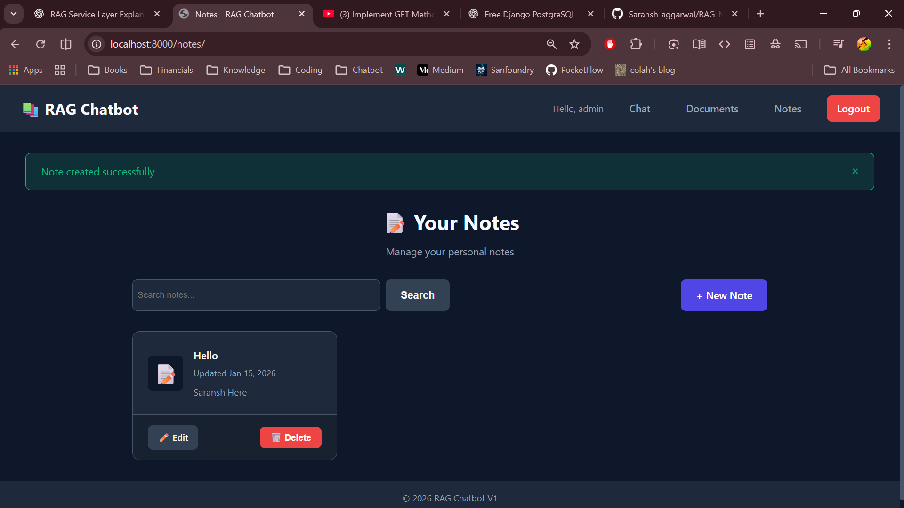

# RAG Note Taker

**RAG Note Taker** is a next-generation productivity tool that bridges the gap between document analysis and personal knowledge management. By leveraging Retrieval-Augmented Generation (RAG) and Google's powerful **Gemini 2.5 Flash** model, it allows users to have intelligent, context-aware conversations with their documents while simultaneously maintaining personal notes.

## 🚀 Features

- **🧠 Advanced RAG Chatbot**
  - Upload generic documents (PDF, DOCX, TXT) and instantly chat with them.
  - Answers are generated purely based on your document context, effectively reducing hallucinations.
  - Powered by **Google Gemini 2.5 Flash**, **Haystack**, and **ChromaDB**.

- **📝 Smart Note Taking**
  - A fully integrated note-taking module.
  - Create, read, update, and delete (CRUD) notes without leaving the application.
  - Organize your thoughts alongside your research.

- **🔒 Secure & Private**
  - Complete user authentication system (Login/Register).
  - User-isolated data: Your documents and notes are only accessible to you.

- **🎨 Modern Interface**
  - Clean, responsive Dark Mode design.
  - Intuitive drag-and-drop file uploads.
  - Real-time chat interface with history.

## 🛠️ Technology Stack

- **Backend**: Django 5.x (Python)
- **AI Engine**: Google Gemini API (Visual & Text)
- **Vector Store**: ChromaDB
- **Orchestration**: Haystack 2.x
- **Frontend**: HTML5, Vanilla CSS3 (Custom Design System), JavaScript
- **Database**: SQLite (Development) / PostgreSQL (Production supported)

## ⚙️ Installation & Setup

Follow these steps to get the project running locally:

### 1. Clone the Repository
```bash
git clone https://github.com/Saransh-aggarwal/RAG-Note-Taker.git
cd RAG-Note-Taker
```

### 2. Set Up Virtual Environment
```bash
# Windows
python -m venv venv
.\venv\Scripts\activate

# macOS/Linux
python3 -m venv venv
source venv/bin/activate
```

### 3. Install Dependencies
```bash
pip install -r requirements.txt
```

### 4. Configure Environment Variables
Create a `.env` file in the root directory and add your credentials:
```env
# Django Settings
SECRET_KEY=your_secret_key_here
DEBUG=True

# Google Gemini API Key
GOOGLE_API_KEY=your_google_api_key_here
```

### 5. Initialize Database
```bash
python manage.py migrate
```

### 6. Run the Application
```bash
python manage.py runserver
```
Visit `http://127.0.0.1:8000` in your browser.

## 📸 Screenshots

### 🔑 Secure Login


### 📂 Document Management


### 💬 Intelligent Chat Interface


### 🗒️ Personal Notes

